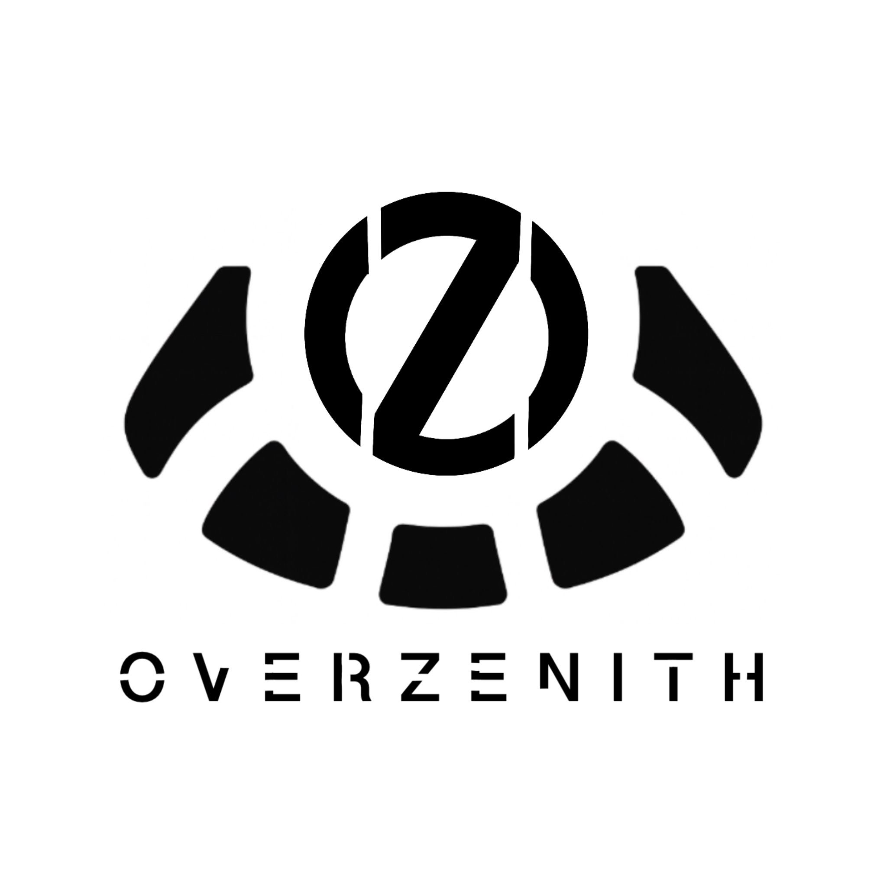

<div align="center">
  
</div>

# 🌍 OverZenith – Bringing Space Closer to Everyone

*"What if curiosity about space could turn into an everyday adventure?"*
desing by: overzenith group.

**OverZenith** is our answer: an **interactive, gamified web platform** designed for the **NASA Space Apps Challenge**.
We transform NASA’s knowledge into an engaging digital journey, making space exploration not a distant dream but a **daily tool for curiosity, learning, and connection**.

---

## 🛰️ About the Project

The goal of **OverZenith** is to create an **accessible and universal platform** that opens the doors of NASA’s knowledge to society in a **clear, immersive, and playful way**.

Too often, space science feels reserved for specialists. We want to change that.
Our vision is to **normalize access to space science**, sparking wonder in children, students, and enthusiasts — anyone with a curious mind.

Through **gamification, interactivity, and design inspired by microgravity**, OverZenith makes learning about space feel like being inside the ISS Cupola, gazing down at Earth.

---

## 🌌 The Experience

Inside OverZenith, users will.  :

- 🌐 **Explore Earth in 3D** – From the **Cupola module of the ISS**, click on interactive points across the globe to unlock NASA-related insights, from astronaut training at the **Neutral Buoyancy Laboratory (NBL)** to essential space science concepts.
- 🧑‍🚀 **Create your astronaut** – Personalize your digital explorer with a name, appearance, and skin, turning the learning process into a personal mission.
- 📚 **Learn through Quizzes** – Test your knowledge, unlock content, and **level up** as you expand your understanding of space.
- ☁️ **Experience Microgravity** – Dynamic floating animations recreate the atmosphere of orbit, transforming the platform into an **immersive adventure**.

✨ In short: **OverZenith transforms space science into an accessible journey**, where curiosity fuels exploration and learning.

---

## 🚀 Why It Matters

- 🌍 **Democratizing Knowledge**: Space exploration shouldn’t belong only to experts. OverZenith makes NASA’s resources approachable for everyone.
- 🎮 **Learning by Playing**: Gamification keeps curiosity alive, turning information into challenges and progress.
- 👩‍🚀 **Inspiring the Next Generation**: By blending science and play, we aim to spark vocations in STEM and bring more people closer to space exploration.

---

## 🧠 Run Locally

### 1️⃣ Clone the repository
```bash
git clone https://github.com/<your-username>/OverZenith.git
cd OverZenith
```

### 2️⃣ Install dependencies

```bash
npm install
```

### 4️⃣ Run the app

```bash
npm run dev
```

Then open the app in your browser

---

## 💻 Tools

Our team developed the platform using React, TypeScript, and TailwindCSS, integrating CesiumJS/react-globe.gl for the 3D Earth. The design was created with a focus on accessibility, creativity, and interactivity — balancing technical precision with visual storytelling.

---

## 👩‍🚀 Team OverZenith

We are a multidisciplinary team passionate about **technology, design, and space exploration**.
Our mission is to make NASA’s knowledge **accessible to everyone**, inspiring curiosity and learning through immersive, gamified experiences.

### 💫 Meet the Crew

* **[Loreto Uzquiano Esteban](https://github.com/loreeue)** – *Systems Engineer and 42 Madrid student, passionate about learning and implementing new technologies to create innovative solutions.*

* **[Daniel Castillo Correa](https://github.com/DanielCasti11o)** – *Software Development student at 42 Madrid, with a strong drive for continuous learning and growth in cutting-edge technologies.*

* **[Gabriel Freire Simón](https://github.com/ByteGab)** – *Full-Stack Developer and 42 Madrid student, focused on scalable architectures and problem-solving, combining technical expertise with a passion for teamwork and innovation.*

* **[Claudia Gil](https://github.com/claauugil)** – *Software Development student at 42 Madrid, eager to explore new technologies and with a strong interest in creative digital solutions.*

* **[Alejandro Gómez Girón](https://github.com/alejogogi)** – *Graphic Designer and Software Development student at 42 Madrid, blending technical precision with artistic vision to craft memorable digital experiences.*

* **[Ángel García Beltrán](https://github.com/angelurano)** – *Full-Stack Developer and 42 Madrid student, focused on creating intuitive, efficient, and accessible web solutions.*

---

<div align="center">
  <sub>Developed for the NASA Space Apps Challenge! 🚀</sub>
</div>
